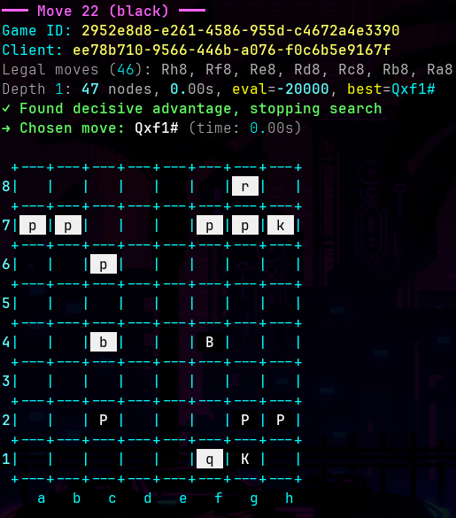

# Build Your Own Chess AI Strategy

This guide explains how to create your own chess AI by implementing a custom `Strategy` class that works with the Chess Arena server.

## Table of Contents
1. [Quick Start Demo](#quick-start)
2. [Quick Start Development](#quick-start-development)
3. [Debugging with VSCode/Cursor](#debugging-with-vscodecursor)
4. [Understanding Standard Algebraic Notation (SAN)](#understanding-standard-algebraic-notation-san)
5. [The StrategyBase Class](#the-strategybase-class)
6. [The choose_move Method](#the-choose_move-method)
7. [Working with the chess.Board Object](#working-with-the-chessboard-object)
8. [Tips for Building Your Strategy](#tips-for-building-your-strategy)
9. [Next Steps](#next-steps)

---

## Quick Start Demo

Install uv: https://docs.astral.sh/uv/getting-started/installation/

Install server:
[https://github.com/eleqtrizit/Chess-Arena-for-Python](https://github.com/eleqtrizit/Chess-Arena-for-Python)
```
uv tool install git+https://github.com/eleqtrizit/Chess-Arena-for-Python
```

Install client:
```
uv tool install git+https://github.com/eleqtrizit/Chess-Arena-for-Python-Client
```

**Terminal 1:**
```
chess-arena --search-time 3
```

**Terminal 2:**
```bash
chess-arena-client --auth-file .player1
```

**Terminal 3:**
```bash
chess-arena-client --auth-file .player2
```

Watch the action!



## Quick Start Development
Install uv: https://docs.astral.sh/uv/getting-started/installation/

```sh
# create folder
mkdir mybot

# setup venv
uv venv

# install client libs
uv pip install git+https://github.com/eleqtrizit/Chess-Arena-for-Python-Client
```
Create a new Python file (e.g., `my_strategy.py`)
```python
#!/usr/bin/env python3
import chess
import random
from typing import List
from chess_arena_client.strategy_base import StrategyBase

import chess

from chess_arena_client.strategy_base import StrategyBase


class Strategy(StrategyBase):
    def choose_move(self, board: chess.Board, legal_moves: List[str], player_color: str) -> str:
        # ... your code goes here
        return selected_move
```

Run it:
```bash
chess-arena-client --strategy my_strategy.py
```

Naive and easy-to-read [my_strategy.py](chess_arena_client/my_strategy.py) can be found here.  Or view the working, more complex
strategy found in [strategy.py](chess_arena_client/strategy.py)

That's it! The Chess Arena client handles all networking, game management, and board synchronization.

**Note:** If you don't specify `--strategy`, the client will use the default built-in strategy from `strategy.py`.

<br>

## Debugging with VSCode/Cursor

Copy this repo's [launch.json](.vsocde/launch.json) into your setup.

<br>


<br>

### ⚠️ IMPORTANT: Server may have a time limit!

There may be a **strict time limit** per move.  <font color=orange>You could be disqualified</font> for going over it! 

You can simulate this with the `--search-time` parameter:

```bash
chess-arena-client --search-time 5.0  # 5 seconds per move
```

Use this parameter to make sure your strategies are able to return a result under the time limit.  See [Time Management Example](#time-management-example)

## Understanding Standard Algebraic Notation (SAN)

**SAN is the standard way chess moves are written.** When you see chess games in books, websites, or apps, they use SAN.

### Basic Move Format

| Move Type | SAN Example | Explanation |
|-----------|-------------|-------------|
| **Pawn move** | `e4` | Move pawn to square e4 |
| **Piece move** | `Nf3` | Move knight (N) to square f3 |
| **Capture** | `Nxe5` | Knight captures piece on e5 |
| **Pawn capture** | `exd5` | Pawn on e-file captures on d5 |
| **Castling kingside** | `O-O` | Castle on the king's side |
| **Castling queenside** | `O-O-O` | Castle on the queen's side |
| **Pawn promotion** | `e8=Q` | Pawn reaches e8 and promotes to queen |
| **Check** | `Qh5+` | Queen moves to h5, giving check |
| **Checkmate** | `Qh7#` | Queen delivers checkmate on h7 |

### Piece Letters
- **K** = King
- **Q** = Queen
- **R** = Rook
- **B** = Bishop
- **N** = Knight (N because K is already taken by King)
- **Pawns have no letter** - just write the destination square

### The Chess Board Grid

The chessboard uses a coordinate system:
- **Files** (columns): Letters a-h from left to right
- **Ranks** (rows): Numbers 1-8 from bottom to top (from white's perspective)

```
  a b c d e f g h    <- Files (columns)
8 ♜ ♞ ♝ ♛ ♚ ♝ ♞ ♜  8
7 ♟ ♟ ♟ ♟ ♟ ♟ ♟ ♟  7
6 · · · · · · · ·  6
5 · · · · · · · ·  5
4 · · · · · · · ·  4
3 · · · · · · · ·  3
2 ♙ ♙ ♙ ♙ ♙ ♙ ♙ ♙  2
1 ♖ ♘ ♗ ♕ ♔ ♗ ♘ ♖  1
  a b c d e f g h
  ^
  Ranks (rows)
```

Every square has a unique name: **file + rank**
- `e4` = column e, row 4
- `a1` = column a, row 1 (white's left corner)
- `h8` = column h, row 8 (black's right corner)

### Disambiguation: When Two Pieces Can Move to the Same Square

Sometimes **two identical pieces** (e.g., two knights) can both legally move to the same square. SAN needs to specify **which piece** you're moving.

**Example scenario:**
```
8 · · · · · · · ·
7 · · · · · · · ·
6 · · · ♞ · · · ·  <- Knight on d6
5 · · · · · · · ·
4 · ♞ · · · · · ·  <- Knight on b4
3 · · · · · · · ·
2 · · · · · · · ·
1 · · · · · · · ·
  a b c d e f g h
```

Both knights can legally move to **d7**. How do we specify which one?

| SAN | Meaning | Explanation |
|-----|---------|-------------|
| `Nbd7` | Knight from **b-file** (column b) moves to d7 | The knight currently on b4 moves to d7 |
| `Ndd7` | Knight from **d-file** (column d) moves to d7 | The knight currently on d6 moves to d7 |

**When disambiguation is needed, add:**
- The **file** (column letter) if the pieces are on different files: `Nbd7`, `Ngd7`
- The **rank** (row number) if on the same file but different ranks: `N1e4`, `N4e4`
- Both file and rank if needed (rare): `Nb4d7`

**More examples:**
```python
"Rae1"   # Rook from a-file moves to e1 (when you have rooks on both a1 and f1)
"R1e4"   # Rook from rank 1 moves to e4 (when you have rooks on both e1 and e8)
"Qh4e1"  # Queen from h4 moves to e1 (fully disambiguated with starting square)
```

**Good news:** You rarely need to worry about this! The `legal_moves` list provided to your strategy already includes properly disambiguated moves.

### Examples in Context

```python
# These are all valid SAN moves:
"e4"        # Push pawn to e4
"Nf3"       # Knight to f3
"Bb5"       # Bishop to b5
"O-O"       # Kingside castle
"Qxd4"      # Queen captures on d4
"e8=Q"      # Pawn promotes to Queen
"Nbd7"      # Knight from b-file (column b) to d7 - disambiguates which knight
"Rh1+"      # Rook to h1 with check
```

### Why SAN?

SAN is:
- **Compact**: "Nf3" instead of "knight from g1 to f3"
- **Unambiguous**: The chess library resolves which piece moves where
- **Standard**: Used worldwide in chess notation
- **Human-readable**: Easy to understand with minimal learning

**Your strategy only needs to return valid SAN strings.** The `python-chess` library and server handle all validation.

---

## The StrategyBase Class

`StrategyBase` is an abstract base class that defines the interface for all chess strategies.

### Class Definition

```python
class StrategyBase(ABC):
    """
    Abstract base class for chess playing strategies.

    :param search_time: Maximum time in seconds for move search
    :type search_time: float
    """

    def __init__(self, search_time: float):
        self.search_time = search_time

    @abstractmethod
    def choose_move(self, board: chess.Board, legal_moves: List[str],
                    player_color: str) -> str:
        """Must be implemented by subclasses"""
        pass
```

### What You Need to Know

1. **Inheritance**: Your strategy class must inherit from `StrategyBase`
   ```python
   class Strategy(StrategyBase):
       pass
   ```

2. **Constructor**: Your class automatically gets `self.search_time` from the parent constructor
   ```python
   # This is handled by StrategyBase, but you can override it:
   def __init__(self, search_time: float):
       super().__init__(search_time)
       # Add any custom initialization here
       self.move_counter = 0
   ```

3. **Required Method**: You **must** implement `choose_move()` - this is where your AI logic lives

---

## The choose_move Method

This is the **only method you need to implement** for a basic strategy.

### Method Signature

```python
def choose_move(self, board: chess.Board, legal_moves: List[str],
                player_color: str) -> str:
    """
    Choose the best move for the current position.

    :param board: Current board position (python-chess Board object)
    :type board: chess.Board
    :param legal_moves: List of legal moves in SAN notation (e.g., ["e4", "Nf3"])
    :type legal_moves: List[str]
    :param player_color: Color of the player ("white" or "black")
    :type player_color: str
    :return: Selected move in SAN notation
    :rtype: str
    """
```

### Parameters Explained

#### 1. `board: chess.Board`

A `python-chess` Board object representing the current game position. This object contains:

- **All piece positions** on the board
- **Whose turn it is** (board.turn: True = white, False = black)
- **Game state** (check, checkmate, stalemate)
- **Move history** and game metadata

**Key methods you can use:**
```python
# Get board state
board.turn                    # True if white's turn, False if black's
board.fullmove_number        # Current move number
board.is_check()             # Is current side in check?
board.is_checkmate()         # Is current side checkmated?
board.is_stalemate()         # Is the position a stalemate?
board.is_game_over()         # Is the game over?

# Get pieces and squares
board.piece_at(chess.E4)     # What piece is on e4? Returns Piece object or None
board.pieces(chess.KNIGHT, chess.WHITE)  # Get all white knights (returns set of squares)

# Get move information
board.legal_moves            # Generator of all legal Move objects
board.is_attacked_by(chess.WHITE, chess.E4)  # Is e4 attacked by white?

# Evaluate position (basic material counting)
# Note: Board doesn't have built-in evaluation, you'd implement this yourself
```

**Important**: The `board` object is a **snapshot** of the current position. You can analyze it freely without affecting the actual game.

#### 2. `legal_moves: List[str]`

A **pre-validated list of all legal moves** in SAN notation.

**Examples:**
```python
# Opening position (white's first move):
legal_moves = [
    "a3", "a4", "b3", "b4", "c3", "c4", "d3", "d4",  # Pawn moves
    "e3", "e4", "f3", "f4", "g3", "g4", "h3", "h4",
    "Na3", "Nc3", "Nf3", "Nh3"  # Knight moves
]

# Mid-game example:
legal_moves = [
    "e5", "Nf3", "Bb5", "O-O", "Qe2", "Rg1", "d4"
]

# Only one legal move:
legal_moves = ["Kh8"]  # Forced king move
```

**Why this is useful:**
- You don't need to generate or validate moves yourself
- Just pick from this list and return it
- Guaranteed to be legal and valid in the current position

#### 3. `player_color: str`

Your assigned color for this game. Either `"white"` or `"black"`.

**Usage:**
```python
if player_color == "white":
    # White-specific logic (you move first, control light squares, etc.)
    pass
elif player_color == "black":
    # Black-specific logic (respond to white's opening, etc.)
    pass
```

**Note**: Most simple strategies ignore this parameter since the board state already determines whose turn it is.

### Return Value

**Must return**: A single move from the `legal_moves` list in SAN notation.

```python
# Valid returns:
return "e4"
return "Nf3"
return "O-O"
return legal_moves[0]  # First legal move
return random.choice(legal_moves)  # Random move
```

**Invalid returns will cause an error**:
```python
return "e5" when "e5" not in legal_moves  # ERROR: Illegal move
return "knight to f3"  # ERROR: Not valid SAN
return None  # ERROR: Must return a string
return ""  # ERROR: Empty string not valid
```

---

## Working with the chess.Board Object

The `python-chess` library provides rich functionality for analyzing positions.

### Common Patterns

#### Checking Specific Squares
```python
def choose_move(self, board, legal_moves, player_color):
    # What piece is on e4?
    piece = board.piece_at(chess.E4)
    if piece and piece.piece_type == chess.PAWN:
        print("There's a pawn on e4!")

    # Is the center controlled?
    center_squares = [chess.E4, chess.E5, chess.D4, chess.D5]
    for square in center_squares:
        if board.is_attacked_by(chess.WHITE, square):
            print(f"White controls {chess.square_name(square)}")
```

#### Counting Material
```python
def count_material(self, board, color):
    """Count total material value for one side."""
    piece_values = {
        chess.PAWN: 1,
        chess.KNIGHT: 3,
        chess.BISHOP: 3,
        chess.ROOK: 5,
        chess.QUEEN: 9,
        chess.KING: 0  # King has no material value
    }

    total = 0
    for piece_type in [chess.PAWN, chess.KNIGHT, chess.BISHOP, chess.ROOK, chess.QUEEN]:
        pieces = board.pieces(piece_type, color)
        total += len(pieces) * piece_values[piece_type]

    return total
```

#### Looking Ahead (Making Virtual Moves)
```python
def evaluate_move(self, board, move_san):
    """Try a move and evaluate the resulting position."""
    # Create a copy to avoid modifying the real board
    test_board = board.copy()

    # Parse SAN and make the move
    move = test_board.parse_san(move_san)
    test_board.push(move)

    # Now test_board shows the position after the move
    if test_board.is_checkmate():
        return 10000  # Checkmate is best!

    # Count material difference
    our_material = self.count_material(test_board, chess.WHITE)
    their_material = self.count_material(test_board, chess.BLACK)

    return our_material - their_material
```

#### Filtering Moves
```python
def choose_move(self, board, legal_moves, player_color):
    # Prefer captures
    captures = [m for m in legal_moves if 'x' in m]
    if captures:
        return random.choice(captures)

    # Prefer checks
    checks = [m for m in legal_moves if '+' in m or '#' in m]
    if checks:
        return random.choice(checks)

    # Otherwise, random move
    return random.choice(legal_moves)
```

### Important chess.Board Methods Reference

| Method | Description |
|--------|-------------|
| `board.turn` | `True` if white to move, `False` if black |
| `board.fullmove_number` | Current move number (starts at 1) |
| `board.fen()` | Get position as FEN string |
| `board.copy()` | Create a copy for testing moves |
| `board.piece_at(square)` | Get piece at square (e.g., `chess.E4`) |
| `board.is_check()` | Is current player in check? |
| `board.is_checkmate()` | Is current player checkmated? |
| `board.is_stalemate()` | Is the position stalemate? |
| `board.is_attacked_by(color, square)` | Is square attacked by color? |
| `board.pieces(piece_type, color)` | Get set of squares with piece type/color |
| `board.parse_san(move_san)` | Convert SAN string to Move object |
| `board.push(move)` | Make a move on the board |
| `board.pop()` | Undo the last move |

---

## Tips for Building Your Strategy

### Start Simple, Then Improve

1. **Phase 1: Random Moves**
   - Just pick a random legal move
   - Verify your strategy connects and plays games successfully

2. **Phase 2: Basic Filtering**
   - Prefer captures over non-captures
   - Prefer checks when available
   - Avoid moves that lose material immediately

3. **Phase 3: Position Evaluation**
   - Count material (pawns, pieces)
   - Control of center squares
   - King safety

4. **Phase 4: Look-Ahead**
   - Try each move and evaluate resulting positions
   - Choose the move leading to the best position
   - Implement minimax or alpha-beta search

### Strategy Ideas

**Beginner Strategies:**
- Random move selection
- Always capture if possible
- Prefer center control (e4, d4, e5, d5)
- Develop pieces before moving queen
- Castle early

**Intermediate Strategies:**
- Material counting with piece values
- One-move look-ahead (evaluate position after each move)
- Prioritize checkmate threats
- Avoid putting pieces en prise (where they can be captured)

**Advanced Strategies:**
- Multi-move search (minimax)
- Position evaluation with multiple factors
- Opening book (pre-programmed first moves)
- Endgame tablebases
- Alpha-beta pruning for performance

#### Best Practices for Time Management

1. **Always leave a time buffer** - Don't use all your time:
   ```python
   def choose_move(self, board, legal_moves, player_color):
       start_time = time.time()
       best_move = legal_moves[0]  # Start with a valid move
       best_score = float('-inf')

       for move in legal_moves:
           # Check if we're running out of time (leave 0.5s buffer)
           if time.time() - start_time > self.search_time - 0.5:
               break

           score = self.evaluate_move(board, move)
           if score > best_score:
               best_score = score
               best_move = move

       return best_move  # Return best move found so far
   ```

2. **Start simple** - Make sure your strategy can respond quickly before adding complex logic

3. **Test with realistic time limits** - Don't develop with `--search-time 60.0` if games use 5.0 seconds

4. **Profile your code** - Use `time.time()` to measure how long different parts take

#### Time Management Example

```python
import time

def choose_move(self, board, legal_moves, player_color):
    start_time = time.time()
    deadline = start_time + self.search_time - 0.5  # Leave buffer

    # Quick evaluation first (guaranteed to finish)
    best_move = self.quick_pick(legal_moves)

    # Then try deeper search if time permits
    if time.time() < deadline:
        better_move = self.deep_search(board, legal_moves, deadline)
        if better_move:
            best_move = better_move

    elapsed = time.time() - start_time
    print(f"Move took {elapsed:.2f}s (limit: {self.search_time}s)")

    return best_move
```

**Remember**: A decent move returned quickly is better than missing your turn!

### Debugging Your Strategy

**Print statements are your friend:**
```python
def choose_move(self, board, legal_moves, player_color):
    print(f"Move {board.fullmove_number}: {len(legal_moves)} legal moves")
    print(f"In check: {board.is_check()}")

    move = self.pick_best_move(board, legal_moves)

    print(f"Chose: {move}")
    return move
```

### Play Against Itself

Run two clients simultaneously to watch your strategy play:

**Terminal 1:**
```
chess-arena --search-time 3
```

**Terminal 2:**
```bash
chess-arena-client --strategy my_strategy.py --auth-file .player1
```

**Terminal 3:**
```bash
chess-arena-client --strategy other_strategy.py --auth-file .player2
```

### Play Against Other Strategies

1. Create multiple strategy implementations
2. Run clients with different strategies using the `--strategy` flag
3. Watch them compete!

---

## Next Steps

1. **Read the Example**: Study [my_strategy.py](my_strategy.py) for a complete working example
2. **Implement Your Strategy**: Create a new file and start with random moves
3. **Test It**: Run against itself to verify it works
4. **Improve Gradually**: Add one feature at a time (captures, center control, etc.)
5. **Measure Performance**: Time your move calculations to stay under the limit

### Resources

- **python-chess documentation**: https://python-chess.readthedocs.io/
- **Chess programming wiki**: https://www.chessprogramming.org/
- **SAN notation guide**: https://en.wikipedia.org/wiki/Algebraic_notation_(chess)

---


**Good luck building your chess AI! 🎯♟️**
